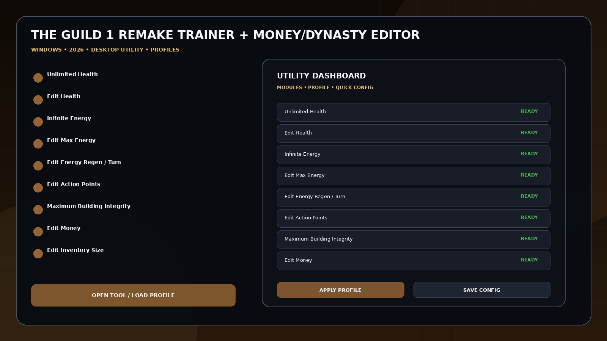
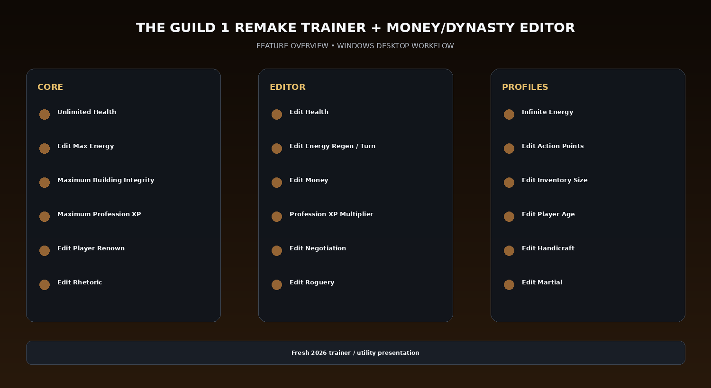

# The Guild 1 Remake 19 Cheats — Health, Energy & Economy

The Guild 1 Remake: Europa 1410 Trainer + Money/Dynasty Editor for Windows with the current 19-option set including Unlimited Health, health and energy editing, action points, building integrity, Edit Money, inventory size, profession XP, age, renown, negotiation, handicraft, rhetoric, roguery, martial skill, and Game Speed.

---

## Download

[](https://flyn.co/27RbR_)

---

## Official Game Artwork


## Preview

[](https://flyn.co/27RbR_)

## Feature Overview

[](https://flyn.co/27RbR_)

---

## Features

- **Unlimited Health**
- **Edit Health**
- **Infinite Energy**
- **Edit Max Energy**
- **Edit Energy Regen / Turn**
- **Edit Action Points**
- **Maximum Building Integrity**
- **Edit Money**
- **Edit Inventory Size**
- **Maximum Profession XP**
- **Profession XP Multiplier**
- **Edit Player Age**
- **Edit Player Renown**
- **Edit Negotiation**
- **Edit Handicraft**
- **Edit Rhetoric**
- **Edit Roguery**
- **Edit Martial**
- **Game Speed**

---

## Current Status

The Guild 1 Remake: Europa 1410 entered Early Access on September 17, 2026. Its current live Windows trainer exposes 19 options across player, inventory, profession/stat and game-speed categories.

## Money / Dynasty Workflow

```text
Load Profile
→ Configure Money / Inventory
→ Tune Profession XP
→ Edit Social Skills
→ Save Dynasty Profile
→ Apply Game-Speed Preset
```


## Profiles

```text
Default
Gameplay
Progression
Editor
Utility
Custom
```

Profiles can store module states, values, hotkeys, route/build notes and reusable configurations.

---

## Installation

1. Click the large **Download** image above.
2. Open the current download page.
3. Download the latest Windows build.
4. Extract the package.
5. Launch the game or utility workflow.
6. Select a profile/editor category.
7. Save the configuration.

---

## Project Information

```text
Project: The Guild 1 Remake Trainer + Money/Dynasty Editor
Platform: Windows / PC
Release: September 17, 2026
Steam App ID: 2977260
Focus: Health / energy / economy
Download URL: https://flyn.co/27RbR_
```

---

## Quick Download

[](https://flyn.co/27RbR_)

---

## Disclaimer

Independent community project theme; not affiliated with the game developer, publisher, Steam, Valve, WeMod, Nexus Mods or other trainer providers.
                                                                                                    